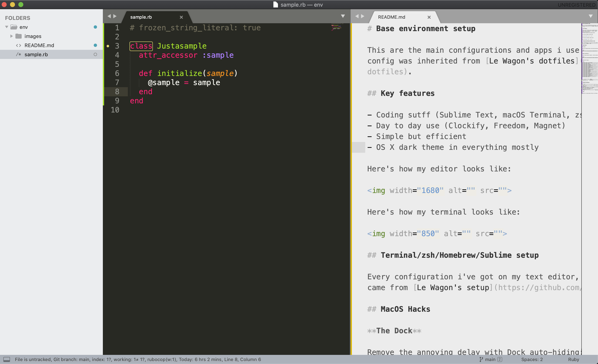
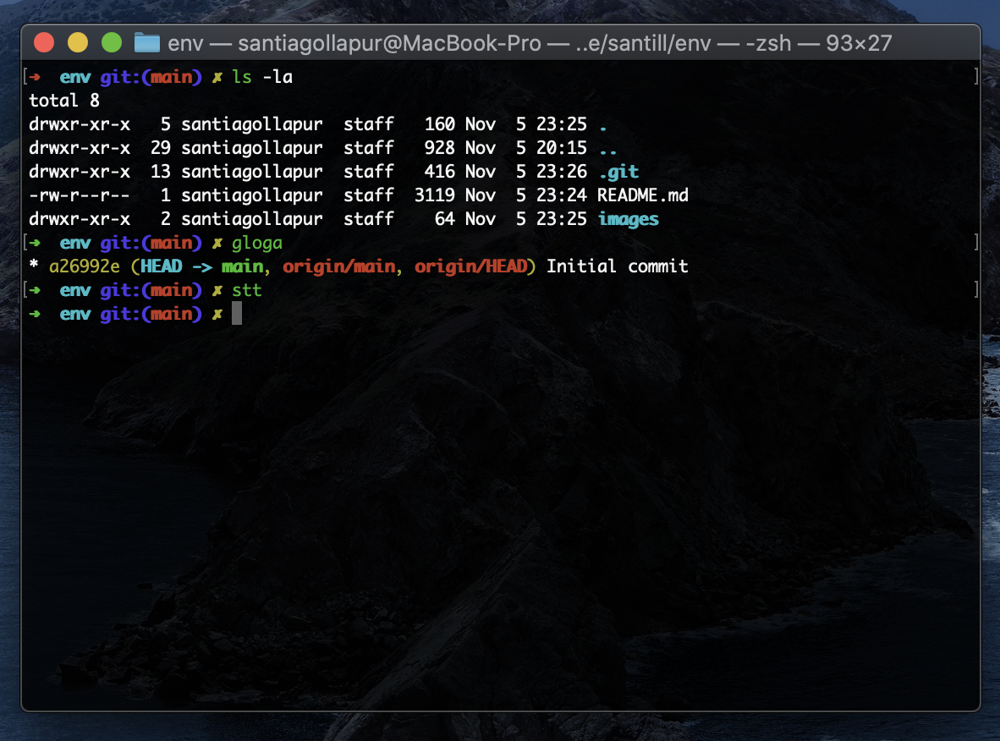

# Base environment setup

This are the main configurations and apps i use on my devices. Most of the config was inherited from [Le Wagon's dotfiles](https://github.com/lewagon/dotfiles).

## Key features

- Coding sutff (Sublime Text, macOS Terminal, zsh shell, Brave Browser)
- Day to day use (Clockify, Freedom, Magnet)
- Simple but efficient
- OS X dark theme in everything mostly

Here's how my editor looks like:



Here's how my terminal looks like:



## Terminal/zsh/Homebrew/Sublime setup

Every configuration i've got on my text editor, terminal and general stuff came from [Le Wagon's setup](https://github.com/lewagon/setup)

## MacOS Hacks

**The Dock**

Remove the annoying delay with Dock auto-hiding:

```bash
defaults write com.apple.Dock autohide-delay -float 0; killall Dock
```

**Reduce animations**

To make things appear snappier, remove unnecessary animations:

```bash
defaults write com.apple.dock expose-animation-duration -float 0
```

**Install OS X apps**

```bash
brew cask install brave-browser # Privacy centric fork of Chrome with built-in 
brew cask install dozer # Clean up your menu bar by hiding non-essential items
brew cask install contexts # Replacement for the default Opt+Tab switcher
brew cask install clockify # Time tracker
brew cask install coconutbattery # Battery health checker
brew cask install freedom # Sites/app blocker for work
brew cask install google-chrome # Alternative browser
brew cask install loom # For screencasting
brew cask install microsoft-office # Multipurpose use
brew cask install nordvpn # VPN
brew cask install pgadmin4 # Database administration interface
brew cask install postman # API Development
brew cask install slack # Principal source of communication
brew cask install sublime-text # Primary code editor
brew cask install telegram # Privacy focused communications
brew cask install visual-studio # Alternative code editor
brew cask install whatsapp # Communications
brew cask install zoom # Videoconference
```

Apps outsiede of brew: [Magnet](https://apps.apple.com/es/app/magnet/id441258766?mt=12) - [Amphetamine](https://apps.apple.com/es/app/amphetamine/id937984704?mt=12)

## Chromium extensions

- [DF Tube](https://chrome.google.com/webstore/detail/df-tube-distraction-free/mjdepdfccjgcndkmemponafgioodelna) block recommendend sections in YouTube
- [JSON Viewer](https://github.com/tulios/json-viewer) prettify json responses
- [Lastpass](https://www.lastpass.com/) for password management
- [News Feed Eradicator for Facebook](http://west.io/news-feed-eradicator) block twitter and facebook feed
- [Video Speed Controller](https://github.com/igrigorik/videospeed)
- [Vimium](https://vimium.github.io/) shortcuts for web browsing

## Font

Currently i'm using native fonts in my editor, but open to try different types.
